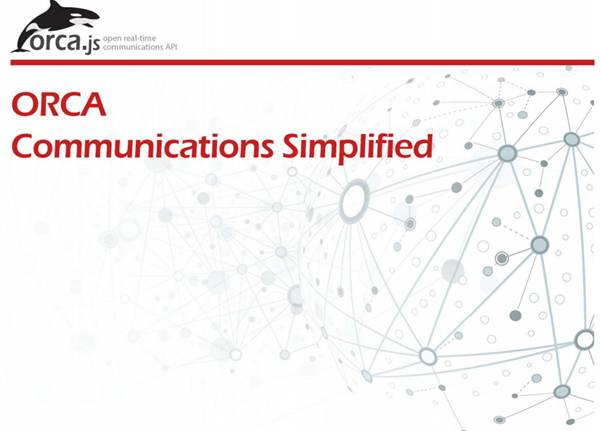

reflector
=========

<h1>Reflector demo application</h1>

<h2>
    Developer manual
</h2>
 
<h3>
    Sommaire
</h3>

    <a href="#_Toc400040352">1. Introduction. </a>

    <a href="#_Toc400040353">2. Quick start. </a>

    <a href="#_Toc400040354">3. Reflector. </a>

    <a href="#_Toc400040355">a. Installation and configuration. </a>

    <a href="">b. Reflector protocol </a>

    <a href="#_Toc400040357">
        4. Orca Transport Library for Reflector. 
    </a>

    <a href="#_Toc400040358">5. Demo application. </a>

 
<h1>
    <a name="_Toc400040352">1. Introduction</a>
</h1>

    The reflector project is a complete client/server demo application highlighting the value of Orca API. It enables a 2 party audio/video chat in a browser.

 This demo application relies on:

<ul>
<li>
a signaling server (so called Reflector) based on NodeJS,
</li>
<li>
a transport library, which an implementation of the Orca API dedicated to the reflector protocol,
</li>
<li>
a simple client application, which is a basic chat UI relying on the transport library.
</li>
</ul>

    The Reflector can be deployed in any environment, the only constraint being to be reachable by the clients. The client application can run in any WebRTC
    compatible browser. It may run locally on the user’s desktop or hosted remotely on a webserver.

    This manual will give a description of the 3 components and the way to get them configured and working in your environment.

<h1>
    <a name="_Toc400040353">2. Quick start</a>
</h1>

    To setup and see the demo running before understanding the role of each component, you can run the following commands for a quick start.

    Install NodeJS (pick installation package adapted to your OS at http://nodejs.org/download/

<pre><code>$ git clone <a href="http://github.com/legat1/reflector">http://github.com/legat1/reflector</a></code></pre>
<pre><code>$ cd reflector</code></pre>
<pre><code>$ npm install</code></pre>
<pre><code>$ sudo npm start</code>    (sudo is require for port below 1024, or admin privileges on other OS)</pre>

    You can access the demo client by going to <a href="http://%3Cserver/">http://&lt;server</a> IP&gt;:443/reflector.htm, where server IP is the IP
    address/server name where nodeJS has been installed.

<h1>
    <a name="_Toc400040354">3. Reflector</a>
</h1>

    The Reflector server is a <code>nodejs</code> component. Find and install the appropriate version for your operating system from
    http://nodejs.org/download/

<h1>
    
    
    a. Installation and configuration
</h1>

    The reflector server can be retrieved from the dedicated GitHub projet

<pre><code>$ git clone http://github.com/orcajs/reflector</code></pre>

    Go to the directory containing the retrieved copy of the Reflector and install it with Node Packet Manager

<pre><code>$ npm install</code></pre>

    You can check that be server works by starting it and ckecking the “out.log” file<code></code>

<pre><code>$ node reflector.js</code></pre>

    The server port can be configured in the <code>config.js</code> file. <code>npm</code> can also be used to start the server as daemon

<pre><code>$ npm start</code></pre>
<h1>
    
    
    b. Reflector protocol
</h1>

    The Reflector is a minimal signaling server that uses WebSocket and JSON elements to exchange messages.

    Using WebSocket, each client must register a session on the serverwith its own user id:

<pre><code>{'method': 'register', 'from': 'myId'}</code></pre>

    In case of success, a 200 ok is sent back:

<pre><code>{'method': 'REGISTER/200/OK'}</code></pre>

    In case of failure, an error is sent back:

<pre><code>{'method': 'REGISTER/400/no-from'}</code></pre>

Once registered, clients can setup a call through a session invitation dialog. Each message MUST have a <code>to</code>, <code>from</code> and    <code>method</code> fields:

<pre><code>{'method': 'INVITE', 'from': 'myId', 'to': 'otherId', 'sdp': 'SDP stuff'}</code></pre>
<pre><code>{'method': 'INVITE/200/OK', 'from': 'otherId', 'to': 'myId', 'sdp': 'SDP stuff'}</code></pre>

    The client is automatically unregistered if its WebSocket connection get closed (closing of the browser, connection cut by a proxy, network failure …).

<h1>
    <a name="_Toc400040357">4. Orca Transport Library for Reflector</a>
</h1>

    Implementing the Orca API, a dedicated transport library is available implementing the Reflector protocol.

    The transport library can be retrieved from the dedicated GitHub projet

<pre><code>$ git clone https://github.com/orcajs/reflector/www/orca</code></pre>

    In order to be used, the transport library has to be integrated in a client application. This application first has to start the library with a
    configuration pointing to the reflector URL (e.g. ws://reflector.ip:port)

<pre><code>sessionConfig = {</code></pre>
<pre><code>            uri: &lt;<em>uri of the reflector&gt;</em></code></pre>
<pre><code>            provider: orcaReflector,</code></pre>
<pre><code>            mediatypes: 'audio,video',</code></pre>
<pre><code>            hostilityhelper: {iceServers: [ {…}, {…} ]}</code></pre>
<pre><code>        };</code></pre>
<pre><code>session = orca.createSession(userId, 'password', sessionConfig);</code></pre>

    It is then up to the client application to implement Orca API calls and callbacks and to map then to the client UI and user interactions

    The sessionConfig contains a “hostilityhelper” parameter that may be useful to setup calls through network hostilities (NAT, firewall, …). You may need 2
    different things:

    - A STUN server to go through NATed networks

    - A TURN server to additionally go through proxy and firewalls

    The hostilityhelper parameter may then be provided this way

<pre><code>Hostilityhelper: { “iceServers”: [ {‘url’:’stun:mystun.com:1234’], [ ‘url’:’turn:myturn.com:5678’] }</code></pre>
<h1>
    <a name="_Toc400040358">5. Demo application</a>
</h1>

    To allow developers to see the benefits of the transport library, a demo client application is provided. It offers a basic UI allowing to:

<ul type="disc">
    <li>
        Register a user session,
    </li>
    <li>
        Establish a 2-way call,
    </li>
    <li>
        Configure the different parameters available in the transport library.
    </li>
</ul>

    The client application can be retrieved from the dedicated GitHub projet

<pre><code>$ git clone https://github.com/orcajs/reflector/www</code></pre>

    It may be run in any WebRTC compatible browser (latest Chrome and Firefox typically). The client page may run locally from your desktop
    (file://reflector.htm) with Firefox or remotely hosted by a web server with Firefox and Chrome.

